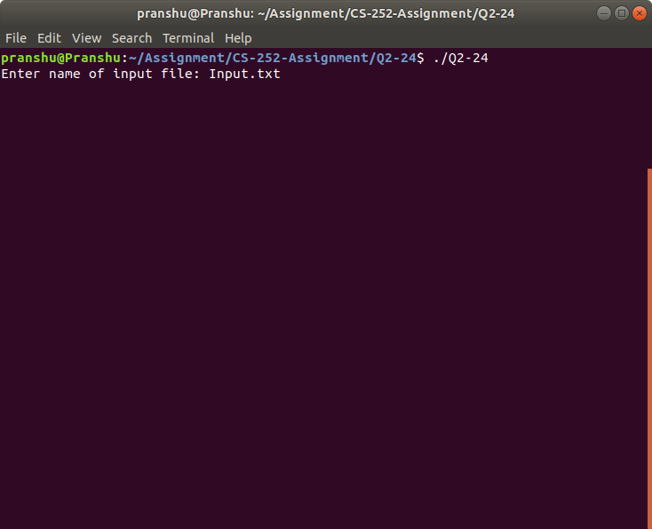
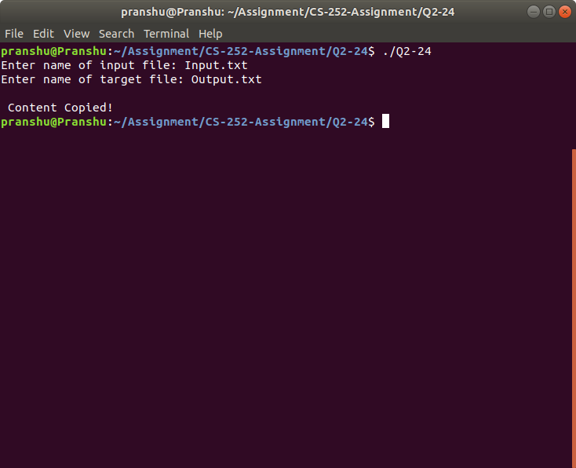
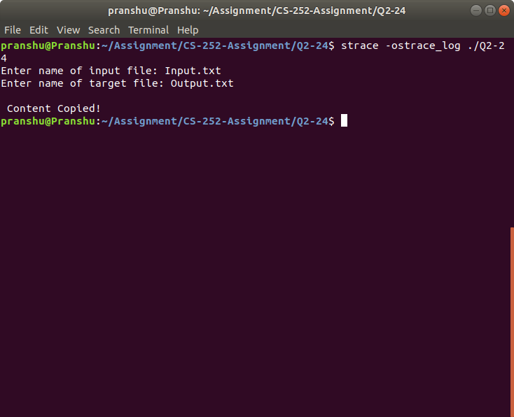

# Question Q2.24

This program works by first prompting the user for
the name of the source and destination files and is written using POSIX.

Once designed and tested the program, the system calls are traced in Linux using **Strace**.


## Steps to Run the program:

1. Open the directory containing the code Q2-24.c
2. Generate a text file of any arbitary name which will be later used in the program application.
3. Compile the program by pasting the following on your terminal.
```bash
gcc Q2-24.c -o Q2-24
```
4. Enter the following command to run the program
```bash
./Q2-24
```

## Screenshots
Running the program:





Result:




## Strace

In order to create a log file for the system calls, run the following Strace command:
```bash
strace -ostrace_log ./Q2-24
```

Screenshot:




Result:


```bash
execve("./Q2-24", ["./Q2-24"], 0x7ffe815056f8 /* 71 vars */) = 0
brk(NULL)                               = 0x561391e0f000
access("/etc/ld.so.nohwcap", F_OK)      = -1 ENOENT (No such file or directory)
access("/etc/ld.so.preload", R_OK)      = -1 ENOENT (No such file or directory)
openat(AT_FDCWD, "/home/pranshu/ROS_WORKSPACES/IEEE_P1/devel/lib/tls/x86_64/x86_64/libc.so.6", O_RDONLY|O_CLOEXEC) = -1 ENOENT (No such file or directory)
stat("/home/pranshu/ROS_WORKSPACES/IEEE_P1/devel/lib/tls/x86_64/x86_64", 0x7ffc9d71dae0) = -1 ENOENT (No such file or directory)
openat(AT_FDCWD, "/home/pranshu/ROS_WORKSPACES/IEEE_P1/devel/lib/tls/x86_64/libc.so.6", O_RDONLY|O_CLOEXEC) = -1 ENOENT (No such file or directory)
stat("/home/pranshu/ROS_WORKSPACES/IEEE_P1/devel/lib/tls/x86_64", 0x7ffc9d71dae0) = -1 ENOENT (No such file or directory)
openat(AT_FDCWD, "/home/pranshu/ROS_WORKSPACES/IEEE_P1/devel/lib/tls/x86_64/libc.so.6", O_RDONLY|O_CLOEXEC) = -1 ENOENT (No such file or directory)
stat("/home/pranshu/ROS_WORKSPACES/IEEE_P1/devel/lib/tls/x86_64", 0x7ffc9d71dae0) = -1 ENOENT (No such file or directory)
openat(AT_FDCWD, "/home/pranshu/ROS_WORKSPACES/IEEE_P1/devel/lib/tls/libc.so.6", O_RDONLY|O_CLOEXEC) = -1 ENOENT (No such file or directory)
stat("/home/pranshu/ROS_WORKSPACES/IEEE_P1/devel/lib/tls", 0x7ffc9d71dae0) = -1 ENOENT (No such file or directory)
openat(AT_FDCWD, "/home/pranshu/ROS_WORKSPACES/IEEE_P1/devel/lib/x86_64/x86_64/libc.so.6", O_RDONLY|O_CLOEXEC) = -1 ENOENT (No such file or directory)
stat("/home/pranshu/ROS_WORKSPACES/IEEE_P1/devel/lib/x86_64/x86_64", 0x7ffc9d71dae0) = -1 ENOENT (No such file or directory)
openat(AT_FDCWD, "/home/pranshu/ROS_WORKSPACES/IEEE_P1/devel/lib/x86_64/libc.so.6", O_RDONLY|O_CLOEXEC) = -1 ENOENT (No such file or directory)
stat("/home/pranshu/ROS_WORKSPACES/IEEE_P1/devel/lib/x86_64", 0x7ffc9d71dae0) = -1 ENOENT (No such file or directory)
openat(AT_FDCWD, "/home/pranshu/ROS_WORKSPACES/IEEE_P1/devel/lib/x86_64/libc.so.6", O_RDONLY|O_CLOEXEC) = -1 ENOENT (No such file or directory)
stat("/home/pranshu/ROS_WORKSPACES/IEEE_P1/devel/lib/x86_64", 0x7ffc9d71dae0) = -1 ENOENT (No such file or directory)
openat(AT_FDCWD, "/home/pranshu/ROS_WORKSPACES/IEEE_P1/devel/lib/libc.so.6", O_RDONLY|O_CLOEXEC) = -1 ENOENT (No such file or directory)
stat("/home/pranshu/ROS_WORKSPACES/IEEE_P1/devel/lib", {st_mode=S_IFDIR|0755, st_size=4096, ...}) = 0
openat(AT_FDCWD, "/opt/ros/melodic/lib/tls/x86_64/x86_64/libc.so.6", O_RDONLY|O_CLOEXEC) = -1 ENOENT (No such file or directory)
stat("/opt/ros/melodic/lib/tls/x86_64/x86_64", 0x7ffc9d71dae0) = -1 ENOENT (No such file or directory)
openat(AT_FDCWD, "/opt/ros/melodic/lib/tls/x86_64/libc.so.6", O_RDONLY|O_CLOEXEC) = -1 ENOENT (No such file or directory)
stat("/opt/ros/melodic/lib/tls/x86_64", 0x7ffc9d71dae0) = -1 ENOENT (No such file or directory)
openat(AT_FDCWD, "/opt/ros/melodic/lib/tls/x86_64/libc.so.6", O_RDONLY|O_CLOEXEC) = -1 ENOENT (No such file or directory)
stat("/opt/ros/melodic/lib/tls/x86_64", 0x7ffc9d71dae0) = -1 ENOENT (No such file or directory)
openat(AT_FDCWD, "/opt/ros/melodic/lib/tls/libc.so.6", O_RDONLY|O_CLOEXEC) = -1 ENOENT (No such file or directory)
stat("/opt/ros/melodic/lib/tls", 0x7ffc9d71dae0) = -1 ENOENT (No such file or directory)
openat(AT_FDCWD, "/opt/ros/melodic/lib/x86_64/x86_64/libc.so.6", O_RDONLY|O_CLOEXEC) = -1 ENOENT (No such file or directory)
stat("/opt/ros/melodic/lib/x86_64/x86_64", 0x7ffc9d71dae0) = -1 ENOENT (No such file or directory)
openat(AT_FDCWD, "/opt/ros/melodic/lib/x86_64/libc.so.6", O_RDONLY|O_CLOEXEC) = -1 ENOENT (No such file or directory)
stat("/opt/ros/melodic/lib/x86_64", 0x7ffc9d71dae0) = -1 ENOENT (No such file or directory)
openat(AT_FDCWD, "/opt/ros/melodic/lib/x86_64/libc.so.6", O_RDONLY|O_CLOEXEC) = -1 ENOENT (No such file or directory)
stat("/opt/ros/melodic/lib/x86_64", 0x7ffc9d71dae0) = -1 ENOENT (No such file or directory)
openat(AT_FDCWD, "/opt/ros/melodic/lib/libc.so.6", O_RDONLY|O_CLOEXEC) = -1 ENOENT (No such file or directory)
stat("/opt/ros/melodic/lib", {st_mode=S_IFDIR|0755, st_size=36864, ...}) = 0
openat(AT_FDCWD, "/etc/ld.so.cache", O_RDONLY|O_CLOEXEC) = 3
fstat(3, {st_mode=S_IFREG|0644, st_size=271177, ...}) = 0
mmap(NULL, 271177, PROT_READ, MAP_PRIVATE, 3, 0) = 0x7fa98ea4c000
close(3)                                = 0
access("/etc/ld.so.nohwcap", F_OK)      = -1 ENOENT (No such file or directory)
openat(AT_FDCWD, "/lib/x86_64-linux-gnu/libc.so.6", O_RDONLY|O_CLOEXEC) = 3
read(3, "\177ELF\2\1\1\3\0\0\0\0\0\0\0\0\3\0>\0\1\0\0\0\20\35\2\0\0\0\0\0"..., 832) = 832
fstat(3, {st_mode=S_IFREG|0755, st_size=2030928, ...}) = 0
mmap(NULL, 8192, PROT_READ|PROT_WRITE, MAP_PRIVATE|MAP_ANONYMOUS, -1, 0) = 0x7fa98ea4a000
mmap(NULL, 4131552, PROT_READ|PROT_EXEC, MAP_PRIVATE|MAP_DENYWRITE, 3, 0) = 0x7fa98e475000
mprotect(0x7fa98e65c000, 2097152, PROT_NONE) = 0
mmap(0x7fa98e85c000, 24576, PROT_READ|PROT_WRITE, MAP_PRIVATE|MAP_FIXED|MAP_DENYWRITE, 3, 0x1e7000) = 0x7fa98e85c000
mmap(0x7fa98e862000, 15072, PROT_READ|PROT_WRITE, MAP_PRIVATE|MAP_FIXED|MAP_ANONYMOUS, -1, 0) = 0x7fa98e862000
close(3)                                = 0
arch_prctl(ARCH_SET_FS, 0x7fa98ea4b500) = 0
mprotect(0x7fa98e85c000, 16384, PROT_READ) = 0
mprotect(0x561390549000, 4096, PROT_READ) = 0
mprotect(0x7fa98ea8f000, 4096, PROT_READ) = 0
munmap(0x7fa98ea4c000, 271177)          = 0
fstat(1, {st_mode=S_IFCHR|0620, st_rdev=makedev(136, 0), ...}) = 0
brk(NULL)                               = 0x561391e0f000
brk(0x561391e30000)                     = 0x561391e30000
fstat(0, {st_mode=S_IFCHR|0620, st_rdev=makedev(136, 0), ...}) = 0
write(1, "Enter name of input file: ", 26) = 26
read(0, "Input.txt\n", 1024)            = 10
openat(AT_FDCWD, "Input.txt", O_RDONLY) = 3
write(1, "Enter name of target file: ", 27) = 27
read(0, "Output.txt\n", 1024)           = 11
openat(AT_FDCWD, "Output.txt", O_RDONLY) = -1 ENOENT (No such file or directory)
openat(AT_FDCWD, "Input.txt", O_RDONLY) = 4
openat(AT_FDCWD, "Output.txt", O_WRONLY|O_CREAT|O_TRUNC, 0666) = 5
fstat(4, {st_mode=S_IFREG|0664, st_size=1879, ...}) = 0
read(4, "Lorem ipsum dolor sit amet, cons"..., 4096) = 1879
fstat(5, {st_mode=S_IFREG|0664, st_size=0, ...}) = 0
read(4, "", 4096)                       = 0
write(1, "\n", 1)                       = 1
write(1, " Content Copied!\n", 17)      = 17
close(4)                                = 0
write(5, "Lorem ipsum dolor sit amet, cons"..., 1879) = 1879
close(5)                                = 0
lseek(0, -1, SEEK_CUR)                  = -1 ESPIPE (Illegal seek)
exit_group(0)                           = ?
+++ exited with 0 +++

```