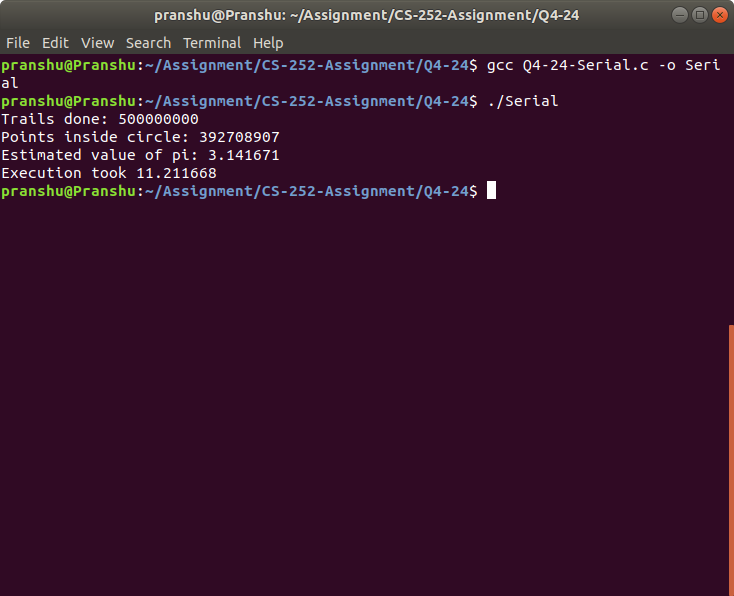
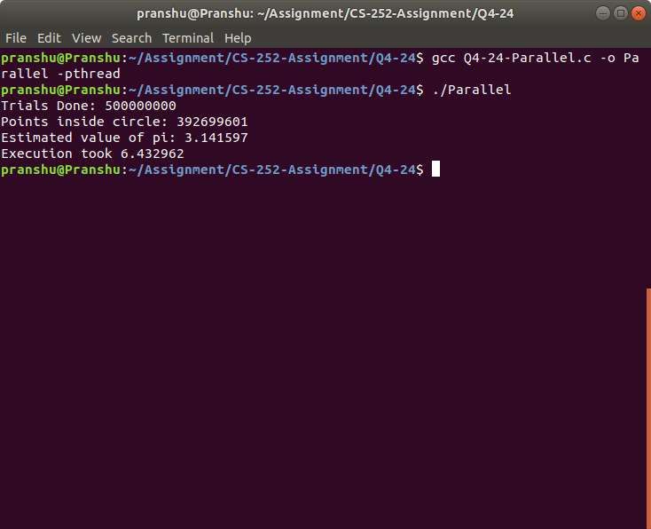

# Question Q4.24

A program for calculating the value of $\Pi$ using a randomization technique known as Monte Carlo. It works as follows:
1. First, we generate a series of random points as simple (x, y) coordinates. These points are made to fall within the Cartesian coordinates that bound the square. Of the total number of random points that are generated,
some will occur within the circle.

2. Next, we estimate the value of $\Pi$ by performing the following calculation:   
$$
\Pi = 4× \frac{number of points in circle}{total number of points}
$$


## Steps to Run the program: (Serial)

1. Open the directory containing the code Q4-24-Serial.c
2. Compile the program by pasting the following on your terminal.
```bash
gcc Q4-24-Serial.c -o Serial
```
3. Enter the following command to run the program
```bash
./Serial
```

## Screenshots
Running the program:



## Steps to Run the program: (Paralle)

1. Open the directory containing the code Q4-24-Parallel.c
2. Compile the program by pasting the following on your terminal.
```bash
gcc Q4-24-Serial.c -o Parallel -pthread
```
3. Enter the following command to run the program
```bash
./Parallel
```

## Screenshots
Running the program:



